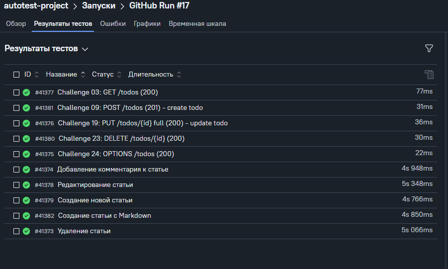
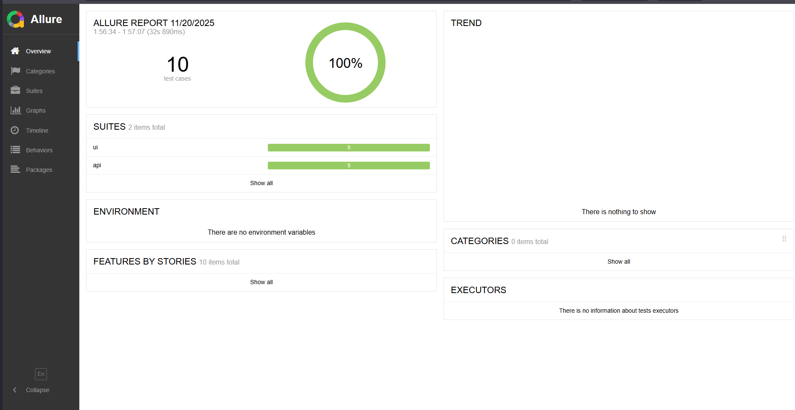
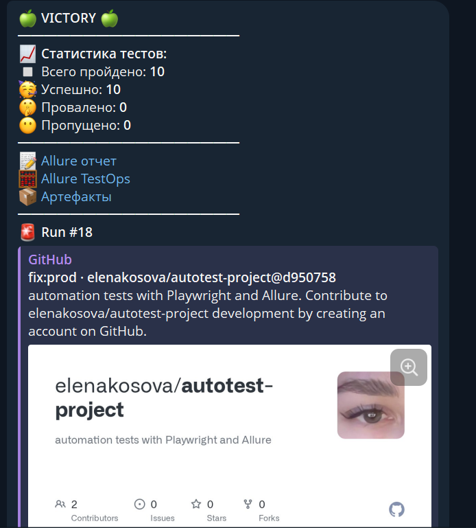

# Autotest Project

Проект автоматизации тестов с использованием современных инструментов.

## Что используется в проекте:

- **Playwright** - для API тестирования
- **Allure** - для красивых отчетов  
- **JavaScript/Node.js** - язык программирования
- **Git** - система контроля версий

## Структура проекта:
new-autotest-project/
├── src/tests/api/ # API тесты
├── src/services/ # Сервисы для работы с API
├── src/builders/ # Генераторы тестовых данных
├── allure-results/ # Результаты для отчетов
└── package.json # Настройки проекта

## Как запустить тесты:

1. Откройте терминал в VS Code (Ctrl+`)
2. Выполните команду: `npm run test:api`
3. Выполните команду: `npm run test:ui`
4. Для просмотра отчета: `npm run allure:serve`

## API для тестирования:

Мы тестируем API по адресу: https://apichallenges.herokuapp.com

## UI для тестирования:

Мы тестируем UI по адресу: https://realworld.qa.guru

TestOps:

Allure:

Telegram:
